  # S3 Multi-Region Access point
  This project showcases the setup and configuration of an S3 Multi-Region Access Point on AWS, enabling efficient and resilient data access across multiple AWS regions. 
 

  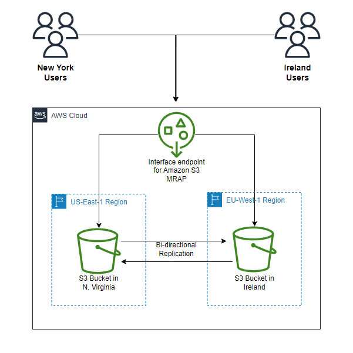

# Project Overview:

The objective of this project is to establish a robust and scalable data storage solution using Amazon S3, leveraging Multi-Region Access Points for enhanced availability and disaster recovery capabilities.

# Components and steps involved in this project:

# 1. S3 Buckets in Different Regions:

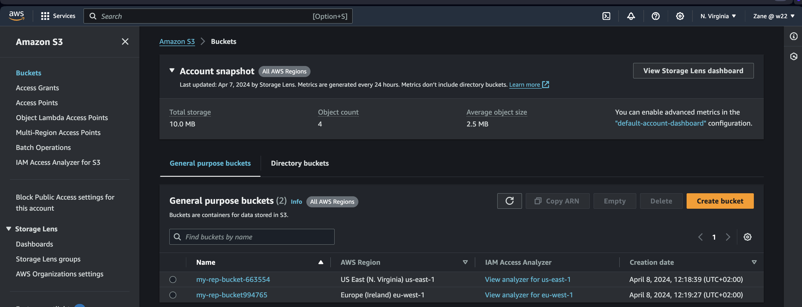

Two S3 buckets were provisioned in separate AWS regions to ensure geographical redundancy and data durability.

# 2. S3 Multi-Region Access Point:

An S3 Multi-Region Access Point was created to abstract the complexity of managing cross-region data access, providing a single endpoint for applications and users.

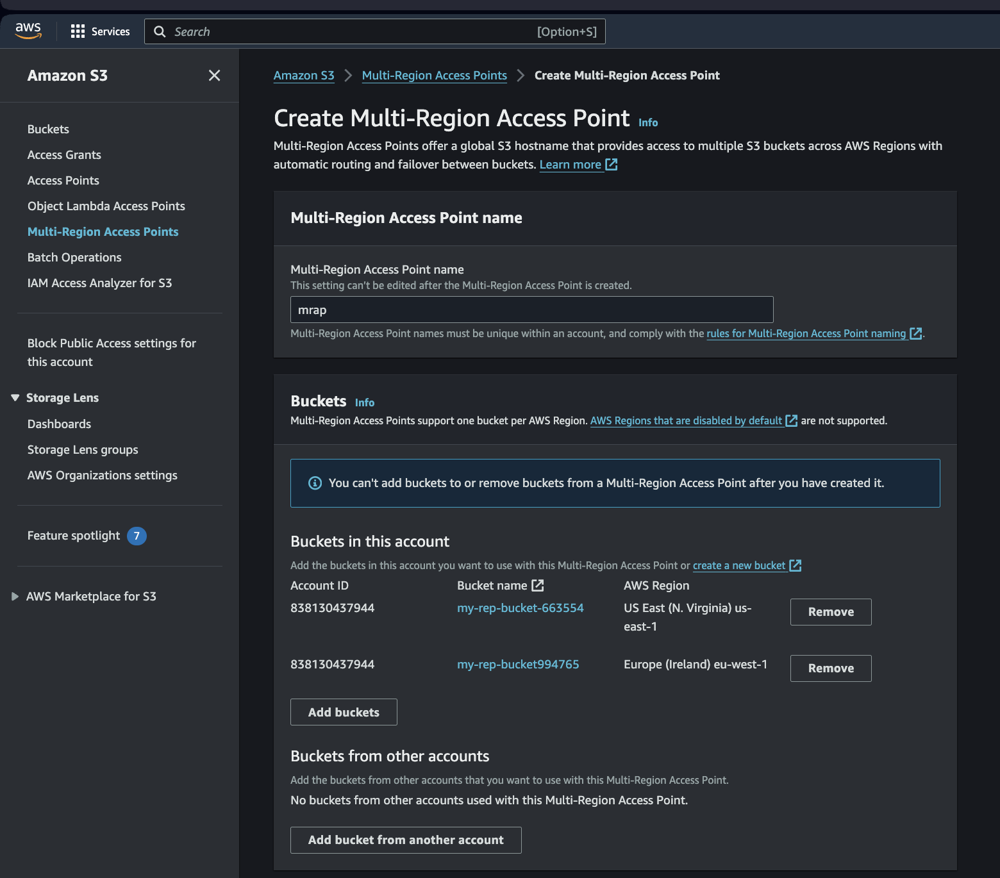

Select Add Buckets, add the 2 buckets you created and create Multi-Region Acess Point.

# 3. S3 Replication:

S3 Cross-Region Replication was configured to automatically replicate objects between the designated source and destination buckets, ensuring data consistency and compliance with data governance policies.

After creating the MRAP wait a few minutes for the Creation to complete.

click on the complete MARP to copy ARN and also create Replication rules.

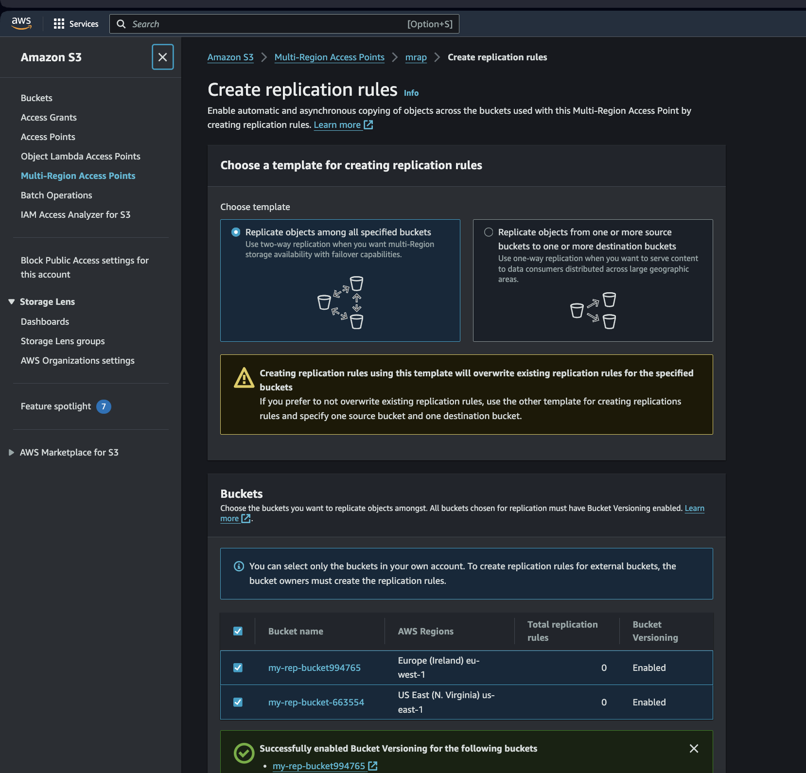

Choose the 2 Buckets created and enable versioning

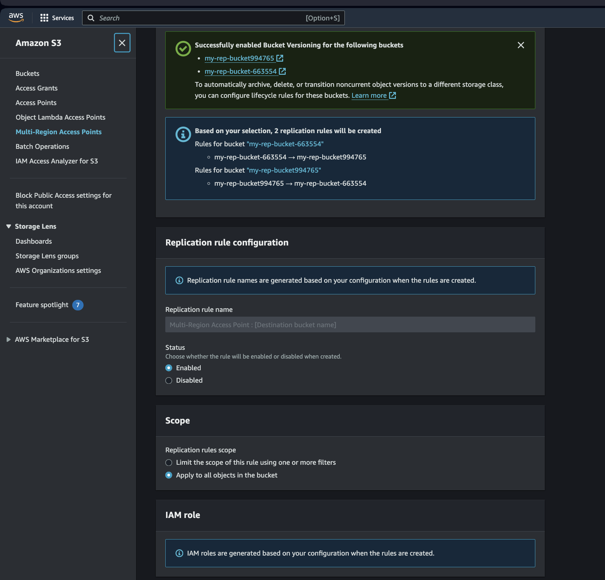

__Scope:__ choose Apply to all bucket 

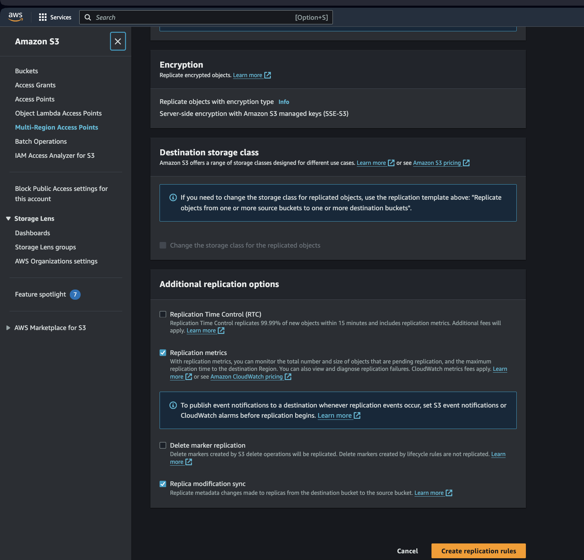

__Replication Overview__

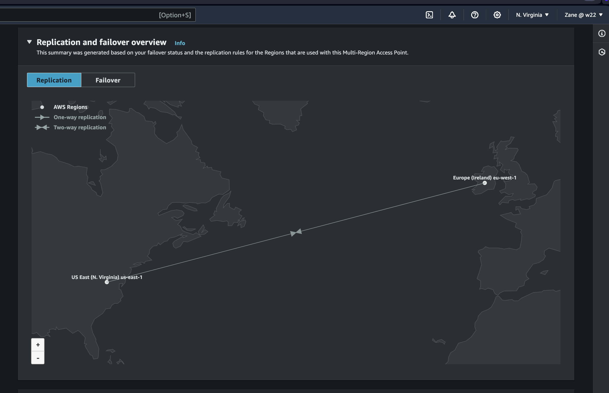

# 4. Failover Configuration:

Failover policies were defined to enable automatic failover to the secondary bucket in case of regional outages or service disruptions, ensuring continuous availability of data and applications.

__Select one region and select edit routing status__

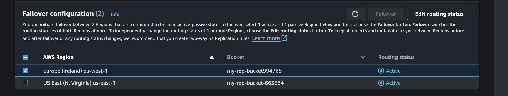

__Select Passive and save routing status__

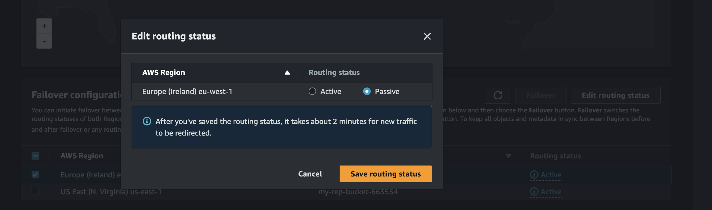

__Failover Overview__

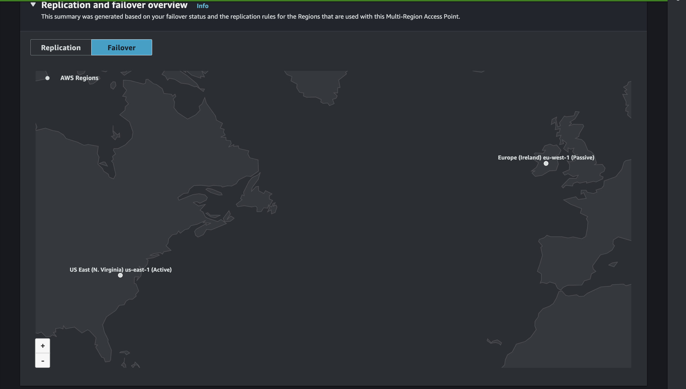

__Select both active and passive regions and select Failover__

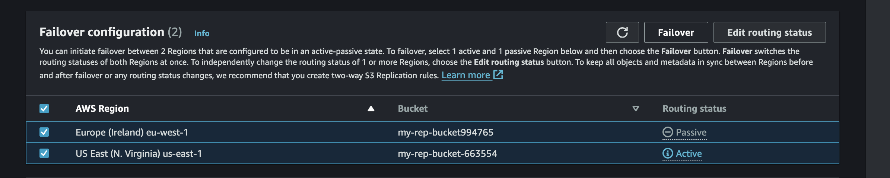

__Confirm Failovers__

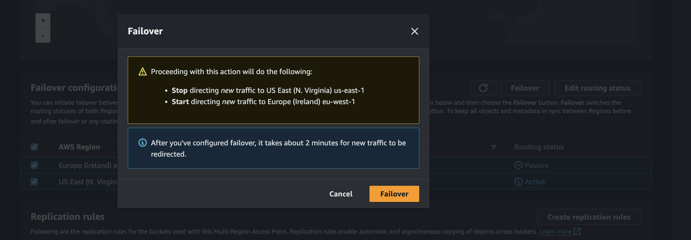

# 5. IAM Permissions:

__IAM__ permissions should be Created for __both S3 buckets.__

Copy __Bucket ARN__ from properties

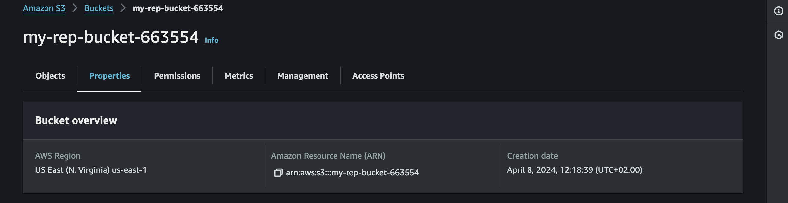

Select __Permission__ to access the __bucket Policy__ and select __edit bucket policy__

Replace s3 ARN and MARP ARN.

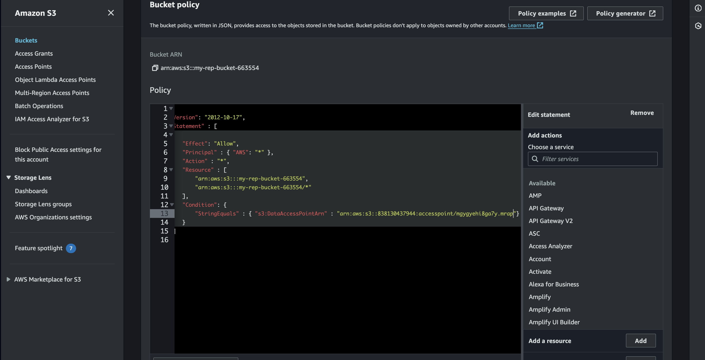

# 6. Testing S3 Multi-region access point and bucket replication.

This command will create a file in the closest bucket. make sure you choose a close region to any of the created regions.

Use Aws Cli to run this command

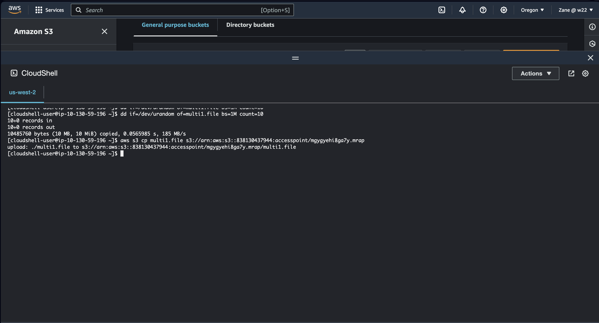

Check your S3 bucket to see file in the bucket close to the selected region where the file was created.

The file will be replicated to the other bucket. check both buckets.

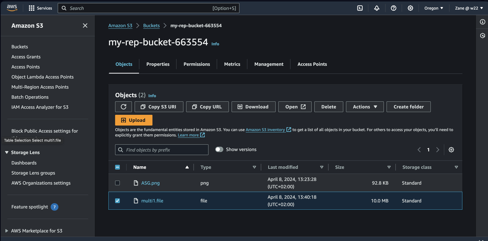
